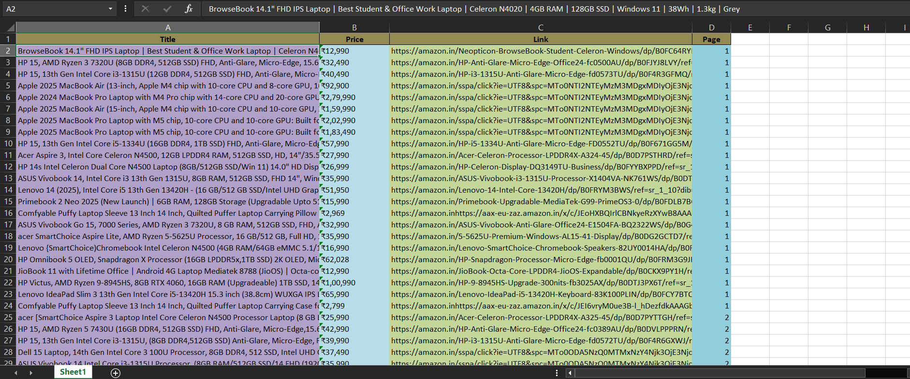

# Amazon Product Scraper with Playwright 🕵️‍♂️

A robust Python scraper that collects product data (Title, Price, Links,page) from Amazon search results using Playwright. It handles dynamic content, pagination, and exports data to both CSV and Excel formats.

# Preview:



## Features
- 🚀 **Dynamic Scraping**: Uses Playwright to render JavaScript-heavy pages.
- 🔄 **Pagination**: Automatically navigates through multiple pages.
- 🛡️ **Anti-Detection**: Implements random delays and mimics human behavior.
- 📊 **Dual Export**: Saves data to `CSV` (UTF-8) and `Excel` (.xlsx).
- 🧹 **Data Cleaning**: Automatically cleans price strings (removes symbols).

## Installation

1. **Clone the repository**
   ```bash
   git clone https://github.com/shivamcodelog/Amazon-Product-Scraper-V2.git
   cd ultimate amazon scraper

2. **Install dependencies**
 pip install -r requirements.txt

3. **Install Playwright browsers**
  playwright install

**Usage**
Run the script:python basic.py


Follow the interactive prompts:
Product you want to Scrape: laptop
Number of product want to scrape: 50
Name of EXTRACTED file: amazon_laptops

***Disclaimer***
This project is for educational purposes only. Please respect Amazon's terms of service and robots.txt.
